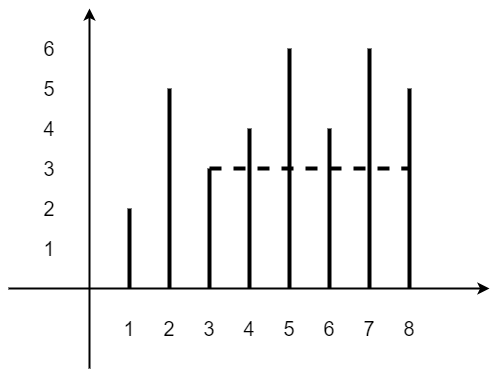

# [11. Container With Most Water](https://leetcode.com/problems/container-with-most-water/description/)

## 题目描述：

Given ***n*** non-negative integers ***a1, a2, ..., an,*** where each represents a point at coordinate ***(i, ai). n*** vertical lines are drawn such that the two endpoints of line ***i*** is at ***(i, ai)*** and ***(i, 0).*** Find two lines, which together with x-axis forms a container, such that the container contains the most water.

Note: You may not slant the container and ***n*** is at least 2.

## 题目翻译

给定一个数组，里面有n个非负整数a1，a2，...，an，其中（数组下标，值）表示坐标（i，ai）处的点。利用这些点绘制n条垂直线，线i的两个端点分别在（i，ai）和（i，0）处。找到两条线，使得它们与x轴形成的容器容水量最多，返回最大的容水量。

注意：容器不可以倾斜装水，n的值至少为2。

## 解题方案

**标签：** Array

**思路：** 

 - 首先根据上图理解题意，相当于存储了height:[2,5,3,4,6,4,6,5]的数组，以height[3]=3和height[8]=5来举例，容水量=宽度*最低高度
 - 最简单的思路就是从左向右进行遍历，两两算出面积，然后求出最大的值，时间复杂度为O(n^2)
 - 很明显可以发现，上面的思路做了很多不必要的比较，因为遍历方式，所以导致了无法过滤掉多余的比较，如果从两侧向中间进行遍历，就可以解决这个问题
 - 设置变量left和right，计算当前容水量，然后和最大容水量进行比较与更新
 - 因为：容水量=宽度*最低高度，宽度在不断变小，所以：最低高度变大才有可能得到更大的容水量
 - 根据上述结论，如果左侧高度小于右侧，则left++，否则right--，时间复杂度为O(n)

**代码：**

```
class Solution {
    public int maxArea(int[] height) {
        int left = 0;
        int right = height.length -1;
        int maxArea = 0;
        while(left<right){
            maxArea = Math.max( maxArea , Math.min( height[left] , height[right] ) * (right-left) );
            if(height[left] < height[right]){
                left++;
            }else{
                right--;
            }
        }
        return maxArea;
    }
}
```
 
## 参考资料

http://blog.csdn.net/kangbin825/article/details/71075651