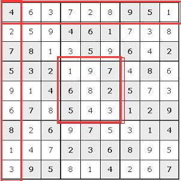
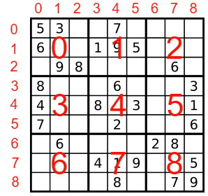

# [36. Valid Sudoku](https://leetcode.com/problems/valid-sudoku/description/)

## 题目描述：

Determine if a Sudoku is valid, according to: [Sudoku Puzzles - The Rules](http://sudoku.com.au/TheRules.aspx).

The Sudoku board could be partially filled, where empty cells are filled with the character **'.'**.


A partially filled sudoku which is valid.

**Note:**
A valid Sudoku board (partially filled) is not necessarily solvable. Only the filled cells need to be validated.

## 题目翻译

根据：**Sudoku Puzzles - The Rules**，来确定数独是否有效。

数独表格可以部分填充，空的单元格用字符'.'来填充。


这是一个有效的部分填充数独。

**注意：**
有效的数独表格（部分填充）不一定是可解的。只有填充单元需要验证。

## 解题方案

**标签：** Hash Table

**思路：**



- 首先如上图所示，有效的数独规则为，每行、每列、每个子九宫格的数字都是正好不重复的1-9，所以判断数独是否有效，即为判断是否出现了重复元素（不包含'.'）
- 那么最基本的思路就是经过三次循环遍历，分别遍历每行、每列、每个子九宫格，判断是否存在除了 '.' 以外的重复元素

**还有没有更好的解法？**

- 使用3个二维数组，rows、cols、boxs分别用来存储行、列、子九宫格的情况
- 其中一维下标 n 对于3个二维数组分别表示：第 n 行，第 n 列，第 n 个子九宫格
- 其中二维下标 m 对于3个二维数组分别表示：在当前行、列、子九宫格的数字m
- 二维数组中的值则表示：该数字出现的次数（在本题中次数超过 1 次即代表重复）
- 举例：rows[2][5] = 1，第 2 行中数字 5 出现了 1 次



- 上图分别标明了行、列和子九宫格，一切都是从0开始
- 行、列号很好定位，通过遍历下标即可获得，关键的在于子九宫格号的获取
- 通过计算可知，当行号为 i，列号为 j 的时候，所处的子九宫格号为 k = i / 3 * 3 + j / 3，比如第3行第2列处在第3个子九宫格中
- 定位到二维数组中的位置后，如果该位置为0，说明未出现过，则变为1，如果为1，则说明出现过，发生重复，则返回false
- 全部检查完毕没有问题则返回true

**代码：**

```java
class Solution {
    public boolean isValidSudoku(char[][] board) {
        int[][] rows = new int[9][9];
        int[][] cols = new int[9][9];
        int[][] boxs = new int[9][9];
        
        for(int i = 0; i < board.length; ++ i)
            for(int j = 0; j < board[i].length; ++ j)
                if(board[i][j] != '.') {
                    int num = board[i][j] - '0' - 1;
                    int k = i / 3 * 3 + j / 3;
                    if(rows[i][num]==1 || cols[j][num]==1 || boxs[k][num]==1)
                        return false;
                    rows[i][num] = cols[j][num] = boxs[k][num] = 1;
                }
        return true;
    }
}
```

## 参考资料

同步发表于 http://blog.csdn.net/grape875499765/article/details/78274332