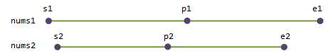
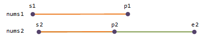

# [4. Median of Two Sorted Arrays](https://leetcode.com/problems/median-of-two-sorted-arrays/description/)

## 题目描述：

There are two sorted arrays **nums1** and **nums2** of size m and n respectively.

Find the median of the two sorted arrays. The overall run time complexity should be O(log (m+n)).

**Example 1:**

```
nums1 = [1, 3]
nums2 = [2]

The median is 2.0
```

**Example 2:**

```
nums1 = [1, 2]
nums2 = [3, 4]

The median is (2 + 3)/2 = 2.5
```

## 题目翻译

有两个已经排序好的数组nums1和nums2，两个数组长度分别为m和n。

找到两个排序数组的中位数。整体运行时间复杂度应为O(log(m+n))。

**示例1：**

```
nums1 = [1,3]
nums2 = [2]

中位数为2.0
```

**示例2：**

```
nums1 = [1,2]
nums2 = [3,4]

中位数为(2 + 3) / 2 = 2.5
```

## 解题方案

**标签：** Array

**思路：**

 - 首先根据题意能获取到以下信息：
	- 可能会碰到多种case, nums1全部大于或全部小于nums2(1,2,3 4,5,6), nums1和nums2交错(2,4,6 1,3,5), 最大最小都属于其中一个序列(1,10 3,4,5), 等等总数为奇数和偶数的处理可能会不太一样
	- 中位数, 或者中位点旁边的两个数, 可能都位于某个数组, 也可能各自分布在两个数组中。
	- 查找中位数的本质，实际上就是查找第k个最小的数

 - 其次是时间复杂度的分析：
	- 先合起来重新排序是不可行的, 时间复杂度太高, 为O((m+n)log(m+n))
	- 先归并排序也是不可行的, 时间复杂度为O(m+n)
	- 用类似桶排的方法时间复杂度为O(m+n), 不可行

#### 由上面的分析可见，**O(log(m+n))的时间复杂度是一个很苛刻的条件**，那么如何得到一个O(log(m+n))的算法呢？

在给出这个答案之前，先给出一个算法的时间复杂度是**O(logm*logn)的答案**，也就是对两个数组分别做二分法查找，找到第k个大的数(kth)

 - 假定需要找nums1的下标(s1,e1)范围内nums2的下标(s2,e2)范围内的第k个大的数，我们先把nums1和nums2各自的中点p1、p2，找出:



 - 假定 p1 >= p2


 - 对于图中黄色的部分，即s1~p1、s2~p2，肯定是小于等于p2元素的，求出这两块元素的数量，赋值给lmargin变量，如果kth<=lmargin，那么第kth元素必然小于p1元素，p1右边的元素可以抛弃。



 - 问题就变成找上图的第kth元素。同样的，依照类似的想法：


 - 如果p1~e1，p2~e2这两部分元素的数目，大于(元素总数-kth)，这就说明，第kth元素，是大于p2元素的。p2以前这块，s2~p2是可以被抛弃的。 


 - 问题就变成，找上图的第kth - (p2 - s2) 个元素。如此可以迭代下去，到其中一对游标相遇的时候，就很好解决了。

 - 如上，找到第k大的数，问题就等于是解决了，可以顺利找到中位数。

#### 分析一下为什么时间复杂度为O(logm*logn)，因为每次对一个数组进行二分查找，时间复杂度为logm，另一个则为logn

**所以二者相乘即为O(logm*logn)的时间复杂度**

## 那么，如何降低时间复杂度到达O(log(m+n))？

因为正常的二分查找的效率为logn，所以log(m+n)，相当于对两个数组进行二分查找，也就是说每次去掉**两个数组总共1/2的数据**才能达到这个效率，而不是像上面一样，每次只去掉了**一个数组1/2的数据**

 - 已知的一种实现方式，就是按照比例，将第k个数的数量分配到两个数组中，然后比较边缘数字，进而去掉一半的数据

现在有<br/>
nums1 = [0 , 1 , 5 , 8 , 9 , 12 , 14] (一共7个数)<br/>
nums2 = [2 , 4 , 10 , 11 , 13] (一共5个数)<br/>
一共12个数字，现在要求出第7个小的数字，也就是9，按照比例<br/>
对于nums1，7 * 7 / ( 7 + 5 ) = 4，也就是nums1中取出4个数<br/>
对于nums2，7 - 4 = 3，也就是nums2中取出3个数<br/>
一共取出7个数，8 < 10，所以第7个最小的数一定不在[0 , 1 , 5 , 8]中<br/>
一共取出7个数，现在比10小的一共有[0 , 1 , 5 , 8]和[2 , 4]一共6个数，所以第7个最小的数一定<10，所以不在[11 , 13]中<br/>

故而问题现在变成了<br/>
[9 , 12 , 14]<br/>
[2 , 4 , 10] <br/>
中寻找第3个最小的数<br/>

直到k为0或者其中一个数组为空，则返回结果<br/>

在上述过程中，数据量一次比较之后缩减了一半，整体的时间复杂度达到了O(log(m+n))

**代码：**

```java
class Solution{
	public static double findMedianSortedArrays(int A[], int B[]) {
		int m = A.length;
		int n = B.length;
		if ((m + n) % 2 != 0)  // 两个数组的元素总个数为奇数
			return (double) findKth(A, B, (m + n) / 2, 0, m - 1, 0, n - 1);
		else { // 两个数组的元素总个数为偶数
			return (findKth(A, B, (m + n) / 2, 0, m - 1, 0, n - 1) 
				+ findKth(A, B, (m + n) / 2 - 1, 0, m - 1, 0, n - 1)) * 0.5;
		}
	}
	// 在A和B两个数组中找到第k小的元素
	public static int findKth(int A[], int B[], int k, int aStart, int aEnd, int bStart, int bEnd) {
		int aLen = aEnd - aStart + 1;
		int bLen = bEnd - bStart + 1;
		if (aLen == 0)  // 数组A为空
			return B[bStart + k];
		if (bLen == 0)  // 数组B为空
			return A[aStart + k];
		if (k == 0)  // 数组A与数组B都只有一个元素
			return A[aStart] < B[bStart] ? A[aStart] : B[bStart];
		//按比例计算第k个元素在A和B数组中的位置
		int aMid = aLen * k / (aLen + bLen); 
		int bMid = k - aMid - 1;
		aMid = aMid + aStart;
		bMid = bMid + bStart;
		if (A[aMid] > B[bMid]) { 
			k = k - (bMid - bStart + 1);
			aEnd = aMid;
			bStart = bMid + 1;
		} else {
			k = k - (aMid - aStart + 1);
			bEnd = bMid;
			aStart = aMid + 1;
		}
		return findKth(A, B, k, aStart, aEnd, bStart, bEnd);
	}
}
```
 
## 参考资料

https://segmentfault.com/a/1190000007938108
https://www.programcreek.com/2012/12/leetcode-median-of-two-sorted-arrays-java/