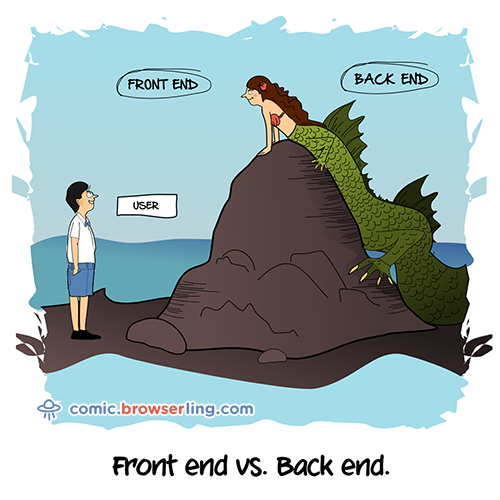
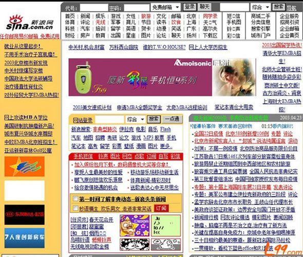
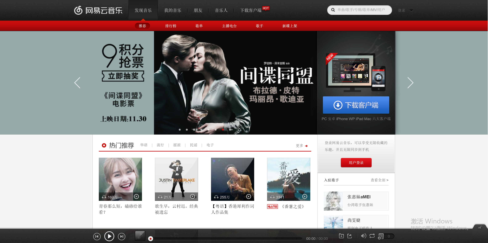
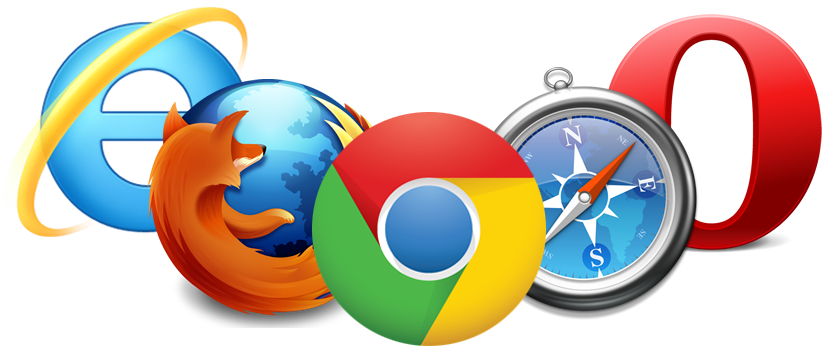
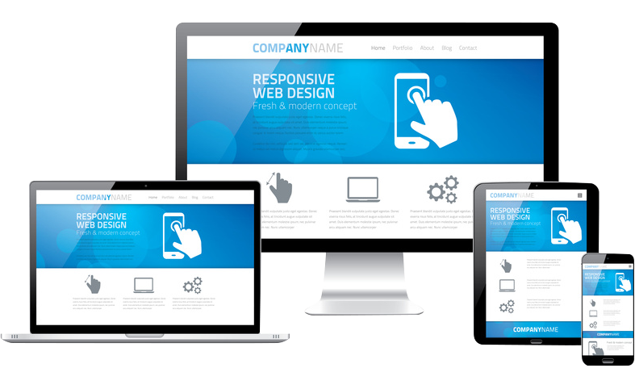

# 前端起步

*   从一个网页说起
*   互联网产品是如何从无到有的
*   前端技能
*   如何学习前端
*   前端资源
*   关于课程
*   或许你还有这些问题

# 从一个网页说起

# 互联网产品是如何从无到有

# 什么是前端

通俗来讲，前端是直接跟用户打交道的部分，也是用户直接可以看得到的部分。

1994年可以看作前端历史的起点，网景推出了第一版Navigator，是为了帮助科学家方便查看文档，穿越论文而创造，完全基于HTML页面，所有内容都是静态的。Javascript的出现给页面加入了动态效果，flash使页面加入了更丰富的动画、视频等，实现了页面富媒体。随着HTML５和CSS3的到来，flash使用逐渐减少，使用HTML、CSS、JS就可以创造出效果非常好的交互效果。从用户角度看，这些年网页已经从单调粗糙的静态网页变成了承载富媒体的动态网页，前端开发人员也不仅仅是切页面那么简单。

一个较为直观的感受，2003年的前端页面是这样的：

现在的页面是这样的：

# 前端技能

## 基础

* HTML、CSS、JavaScript

HTML是HyperText Mark-up Language的缩写，即超文本标签语言。通过标签实现网页元素的排列，定义网页结构构成网页的*骨架*。

CSS是Cascading Style Sheets，即层叠样式表，用来定义HTML元素的样式，可以改变站点中所有页面的布局和外观，是网页的*皮肤*。

掌握这两者就可以将设计师的设计稿转换成静态网页，CSS3中的animation等属性可以实现简单的动画。目前最新的标准是HTML5和CSS3，加入了更多有利于开发的新特性。

JavaScript是一种轻量级网页脚本语言。与Java有一些共性但完全是另外一门语言。设计初衷为了解决和网页的交互问题。可以灵活地操作HTML、CSS元素，也是连接前端和后台服务器的桥梁，是网页的*动作*。

掌握Javascript就可以实现网页的一些较为复杂的动画，并且懂得前后台如何借助Javascript进行交互。

* 浏览器兼容性

网页是由浏览器渲染而成的，HTML，CSS和JavaScript在国际化上都有组织进行标准化，但目前的浏览器的内核各有不同，因此对特性的支持不尽相同，但前端开发人员要学会满足不同浏览器用户的需求，因此要进行浏览器兼容性调试。一个网页要根据需求在不同浏览器上能正常显示才可以。

* 响应式布局

移动互联网使人们进入多屏时代，终端的种类众多：PC、pad、手机等，大小也不尽相同。响应式布局就是网页能够自适应不同的终端，给用户提供统一、舒适的体验，目前主要通过媒体查询实现。会使用Bootstrap框架。

学到这里，你已经可以根据自己的需求做出相应的网页效果，并且懂得基本的浏览器兼容性和响应式布局，在网页开发方面拥有自学能力，玩出花样。接下来的学习会扩充你的后台知识，使你成为一名真正合格的前端开发人员。

## 进阶

* Jquery库、Bootstrap框架

Jquery库大大简化了Javascript的语法，Bootstrap可以快速完成响应式布局。

* HTTP协议

协议是两台计算机通信时必须遵守的规定和规则，而HTTP协议是互联网的基础协议，前后端就是通过HTTP协议进行数据交互的，是前端开发人员的必备知识。

* 通过JSON获取数据

JSON是一种轻量级的数据交换文本格式，是前后端进行数据交换的重要形式。

* 正则表达式

正则表达式是一种描述文本规则的代码，可以利用比较简单的代码对复杂模式描述。

* 服务器脚本语言（PHP,ASP,NET,JSP）

前端工程师需要与后台提供的接口配合，通过GET／POST方法完成页面提交、数据库增删改查等操作，懂得一门后台语言会大大便利自己的开发。服务器脚本语言用的比较多的是PHP，也比较适合新手入门。

掌握这些知识，你已经是一个合格前端工程师，可以胜任一个普通前端工程师的岗位。接下来的学习会帮助你成为一名优秀的前端工程师。

## 高级：学无止境

*   页面性能优化，SEO站内优化……
*   模块化
    *   **AMD** (Asynchronous Module Definition) `RequireJS`
    *   **CMD** (Common Module Definition) `SeaJS`、`NodeJS`

*   框架化
    *   `underscore`、`jQuery`、`BootStrap`
    *   **MV*** (MVC、MVVM) `Backbone`、`Vue.js`、`AngularJS`
    *   `Web Components`、`Flux`

*   自动化
    *   CoffeeScript、TypeScript
    *   Sass、Less
    *   模板引擎
    *   Grunt、Gulp

前端知识日新月异，前端的学习也不是一劳永逸，要成为一名优秀的前端工程师，就要不断接受新的知识、新的思想。此时的你已经学会可以独自扬帆起航、满载而归——自学，学无止境！

## 软技能

* 工具使用：Sublime、WebStorm、PhotoShop、Git等
* 调试：chrome等浏览器调试；
* 搜索：Google、stackoverflow；国内 segmentfault、CSDN、知乎、博客园等；大牛博客；
* 写博客：github page 静态博客; wordpress、ghost博客框架; CSDN、博客园、简书等平台;
* 英语：写代码、国外搜索提问、英文文档等。
* 兴趣是最好的老师，保持学习的热情，不可急于求成！

这些技能虽不属于前端知识的范畴，但对学习前端来讲都有着举足轻重的作用，是一个程序开发人员的必备技能。

# 如何学习前端

 * 多动手，以在线文档为主要参考。
 * 多交流，与授课老师、一同学习的同学交流。
 * 多查阅资料，提倡主动学习，不只是被动接受。
 * 渐渐扩充计算机基础知识。

# 前端资源

### 在线文档

*   [w3cschool.cc](http://w3cschool.cc)，适合零基础
*   [MDN](https://developer.mozilla.org/zh-CN/docs/Web)，入门必看
*   [W3C标准草案](http://www.w3.org/TR/) [CSS2](http://www.w3.org/TR/CSS2/) [HTML4.01](http://www.w3.org/TR/html4/) [HTML5](http://www.w3.org/TR/html5/)，全英，追根溯源
*   各框架的官方文档

### 个人博客

*   [张鑫旭的博客](http://www.zhangxinxu.com/wordpress/)
*   [小胡子哥Blog Entry](http://www.barretlee.com/entry/)
*   [阮一峰的个人网站](http://www.ruanyifeng.com/blog/)
*   [汤姆大叔Javascript](http://www.cnblogs.com/TomXu/tag/JavaScript/)
*   ……
### 团队博客：

*	[ 腾讯AlloyTeam Blog，腾讯全端 AlloyTeam 团队 Blog](http://www.alloyteam.com/)
*	[百度：首页 - FEX](http://fex.baidu.com/)
*	[360团队，奇舞团博客](http://www.75team.com/about)
*	[奇舞团：奇舞团博客](https://75team.com/)
*	[大搜车：大搜车前端团队博客](http://f2e.souche.com/blog/)

### 前端网站：

*   [echojs，英文](http://www.echojs.com/)
*   [div.io](http://div.io)
*   [w3cplus](http://www.w3cplus.com/)
*   [伯乐在线：WEB前端 - 伯乐在线](http://web.jobbole.com/)
*   [前端乱炖](http://www.html-js.com/)
*   [stackoverflow](http://stackoverflow.com/)
*   [SegmentFault](https://segmentfault.com/)
*   [CSDN](http://www.csdn.net/)
*   ……

### 书籍

*   图解 HTTP
*   JavaScript 高级程序设计
*   JavaScript 权威指南
*   JavaScript 设计模式
*   高性能网站建设指南
*   ...

# 关于课程

## 课前准备

1.  安装文本编辑器 [Sublime text3](http://www.sublimetext.com/3) 或者 [WebStrom](https://www.jetbrains.com/webstorm/) 。
2.  安装 Chrome 浏览器，[官方下载地址](http://www.google.cn/chrome/browser/desktop/index.html)、[QQ群文件](https://jq.qq.com/?_wv=1027&k=42GqFSj)

## 教学内容和方式

- 教学内容共分13个课时，每课时时长1.5小时，共计20小时左右。
- 第1节前端起步、第2-4节HTML、第5-9节CSS、第10节实战、第11-12节JS基础，完成后掌握HTMl、CSS基础，拥有搭建网页能力。
- 每周四晚19：00-20：30 腾讯课堂直播。
- 上课前一天在群里给出下节课要讲的内容、参考的网上资料。

# 或许你还有这些问题？

*   我是零基础能转行前端吗？
*   学习多久能够成为一名可以入职的前端工程师？
*   前端跟后端相比很LOW么？

加入码蜂社前端交流群[QQ群: 180251611](https://jq.qq.com/?_wv=1027&k=42GqFSj)，和Mark老师、热爱学习的同学们交吧！
